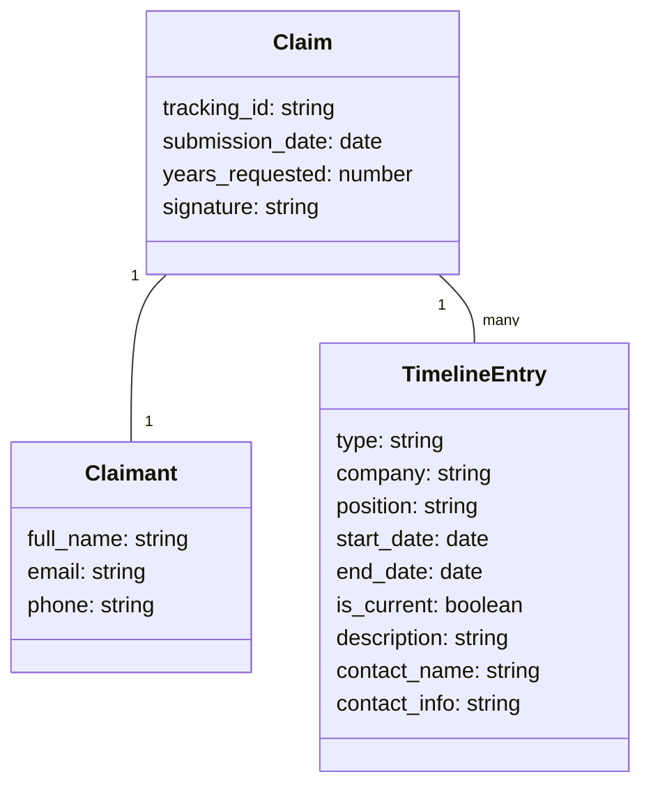

# Trua Verify Data Model

This document describes the data structures used in the Trua Verify system, their relationships, and how they map to the system's functionality.

## Data Model Diagram



## Data Structures

### Claim

The `Claim` is the central data structure that represents a complete employment history submission.

**Attributes**:
- `tracking_id`: String - Unique identifier for the verification request, provided in the invitation URL
- `submission_date`: Date - When the claim was submitted, automatically generated
- `years_requested`: Number - Required timeframe to account for (e.g., 7 years)
- `signature`: String - Base64-encoded PNG image of the candidate's signature

**Relationships**:
- Has one `Claimant` (the person submitting the claim)
- Has many `TimelineEntry` objects (the employment history)

**Storage**:
- Stored as JSON in `claims/truaverify_<tracking_id>_<date>.json`
- Also represented in PDF format in `claims/truaverify_<tracking_id>_<date>.pdf`

### Claimant

The `Claimant` represents the individual submitting the employment history claim.

**Attributes**:
- `full_name`: String - The candidate's full name
- `email`: String - The candidate's email address
- `phone`: String - The candidate's phone number (optional)

**Relationships**:
- Belongs to one `Claim`

**Storage**:
- Nested within the `Claim` JSON structure
- Displayed prominently in the PDF document

### TimelineEntry

A `TimelineEntry` represents a single period in the candidate's employment history.

**Attributes**:
- `type`: String - Type of entry (Job, Education, Unemployed, Other)
- `company`: String - Company or organization name (required for Job/Education)
- `position`: String - Position or title (required for Job/Education)
- `start_date`: Date - When the period began
- `end_date`: Date - When the period ended (null if current)
- `is_current`: Boolean - Whether this is the current position
- `description`: String - Additional details about the period (optional)
- `contact_name`: String - Name of reference contact (required for Job)
- `contact_info`: String - Email or phone of reference contact (required for Job)

**Relationships**:
- Belongs to one `Claim`

**Storage**:
- Stored as an array within the `Claim` JSON structure
- Displayed as separate sections in the PDF document

## JSON Structure Example

```json
{
  "tracking_id": "abc123",
  "submission_date": "2025-03-17",
  "years_requested": "7",
  "claimant": {
    "full_name": "John Michael Smith",
    "email": "john.smith@example.com",
    "phone": "555-987-6543"
  },
  "timeline": [
    {
      "type": "Job",
      "company": "Nexlify",
      "position": "Product Manager",
      "start_date": "2020-06-01",
      "end_date": "2023-05-31",
      "is_current": false,
      "description": "",
      "contact_name": "Jane Doe (Supervisor, Senior Engineering Manager)",
      "contact_info": "555-123-4567, jane.doe@nexlify.com"
    },
    {
      "type": "Job",
      "company": "Freelance",
      "position": "Consultant",
      "start_date": "2019-01-01",
      "end_date": "2020-05-31",
      "is_current": false,
      "description": "",
      "contact_name": "John Smith (Client, Project Lead)",
      "contact_info": "john.smith@clientco.com"
    },
    {
      "type": "Unemployed",
      "company": "",
      "position": "",
      "start_date": "2018-03-17",
      "end_date": "2018-12-31",
      "is_current": false,
      "description": "Sabbatical and job search",
      "contact_name": "",
      "contact_info": ""
    }
  ],
  "signature": "data:image/png;base64,iVBORw0KGgoAAAANSUhEUgAA..."
}
```

## Data Validation Rules

### Claim Validation
- `tracking_id` must be present
- `years_requested` must be a positive number
- `signature` must be present and a valid Base64-encoded image

### Claimant Validation
- `full_name` must be present
- `email` must be present and a valid email format
- `phone` is optional

### TimelineEntry Validation
- `type` must be one of: "Job", "Education", "Unemployed", "Other"
- `company` is required if `type` is "Job" or "Education"
- `position` is required if `type` is "Job" or "Education"
- `start_date` must be present and a valid date
- `end_date` must be present and a valid date, unless `is_current` is true
- `start_date` must be before `end_date` if both are present
- `contact_name` is required if `type` is "Job"
- `contact_info` is required if `type` is "Job"
- The total time covered by all entries must meet or exceed `years_requested`

## Data Flow

1. **Data Collection**:
   - Form fields map directly to data structure attributes
   - Client-side validation ensures data integrity

2. **Data Processing**:
   - Server parses form data into structured objects
   - Timeline entries are processed from indexed form fields

3. **Data Storage**:
   - Complete data structure is serialized to JSON
   - Same data is formatted into PDF

4. **Data Retrieval**:
   - PDF is provided to candidate for download
   - JSON is available for programmatic access

## Data Security Considerations

The current implementation has the following data security characteristics:

1. **Data Exposure**:
   - Personal information (name, email, phone) is stored in plain text
   - Employment history details are stored in plain text
   - Signature is stored as Base64-encoded image

2. **Access Control**:
   - No authentication mechanism for accessing stored claims
   - Files are accessible via direct URL if filename is known

3. **Data Integrity**:
   - No digital signatures or checksums to verify document authenticity
   - No versioning to track changes to claims

## Future Data Model Enhancements

The data model could be extended to include:

1. **User Accounts**:
   - Add authentication and authorization models
   - Associate claims with user accounts

2. **Verification Status**:
   - Add status tracking for the verification process
   - Include verification results and notes

3. **Audit Trail**:
   - Track all interactions with the claim
   - Record timestamps and actions

4. **Document Versioning**:
   - Support multiple versions of a claim
   - Track changes between versions