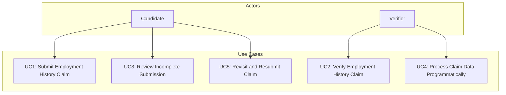

# Trua Verify Use Case Diagram

This document outlines the primary use cases for the Trua Verify system and how they relate to the system actors.

## Use Case Diagram

## Detailed Use Cases

### UC1: Submit Employment History Claim

**Actor**: Candidate

**Goal**: Submit a complete, signed employment history claim for a specified timeframe as part of a job application.

**Preconditions**:
- Candidate receives an invitation link from the Verifier (e.g., `http://localhost:5000/verify?tracking_id=abc123&years=7`).
- System is accessible via a web browser.

**Steps**:
1. Candidate clicks the invitation link, loading the Trua Verify form with tracking_id pre-filled.
2. Candidate enters personal info:
   - Full Name: "John Michael Smith"
   - Email: "john.smith@example.com"
   - Phone: "555-987-6543" (optional).
3. Candidate selects or confirms the timeframe (e.g., "Last 7 Years").
4. Candidate adds timeline entries:
   - Job: "Product Manager at Nexlify, 2020-06-01 to 2023-05-31" with contact "Jane Doe (Supervisor, Senior Engineering Manager), 555-123-4567, jane.doe@nexlify.com".
   - Job: "Consultant at Freelance, 2019-01-01 to 2020-05-31" with contact "John Smith (Client, Project Lead), john.smith@clientco.com".
   - Gap: "Unemployed, 2018-03-17 to 2018-12-31".
5. System calculates and displays "Time accounted for: 7.2 years," confirming coverage.
6. Candidate signs digitally on the canvas, certifying accuracy.
7. Candidate submits the form.
8. System generates and saves a PDF (truaverify_abc123_20250317.pdf) and JSON (truaverify_abc123_20250317.json) in the claims directory.
9. Candidate downloads the PDF and sends it to the Verifier as instructed.

**Postconditions**:
- Claim is stored with tracking_id "abc123" in claims.
- Candidate has a PDF copy for their records.

**Exceptions**:
- If timeframe isn't covered (e.g., "6.5 years"), system alerts: "Please account for at least 7 years."
- If required fields (e.g., full_name, email, job company_name) are missing, submission fails with an error.

### UC2: Verify Employment History Claim

**Actor**: Verifier

**Goal**: Confirm the candidate's employment history using the submitted claim.

**Preconditions**:
- Verifier has provided the tracking_id (e.g., "abc123") in the invitation.
- Candidate has submitted the claim, and the PDF is received (e.g., via email).
- Verifier has access to the claims directory (manually or via future system integration).

**Steps**:
1. Verifier opens the PDF (truaverify_abc123_20250317.pdf):
   - Sees claimant: "John Michael Smith, john.smith@example.com, 555-987-6543".
   - Reviews timeline covering 7 years with job details and contacts.
   - Confirms signature and submission date ("2025-03-17").
2. Verifier contacts "Jane Doe" (555-123-4567 or jane.doe@nexlify.com) to verify the Nexlify job:
   - Confirms "John Michael Smith" was "Product Manager" from 2020-06-01 to 2023-05-31.
3. Verifier contacts "John Smith" (john.smith@clientco.com) to verify the Freelance job:
   - Confirms consultancy work from 2019-01-01 to 2020-05-31.
4. Verifier notes the "Unemployed" gap (2018-03-17 to 2018-12-31) requires no further check.
5. (Optional) Verifier retrieves the JSON (truaverify_abc123_20250317.json) from claims to process data programmatically (e.g., import into HR system).

**Postconditions**:
- Verifier confirms the claim's accuracy and ties it to "John Michael Smith" via claimant details.
- Employment history is validated for the job application.

**Exceptions**:
- If contact info is missing or invalid, Verifier may contact the claimant directly (e.g., via "john.smith@example.com").
- If timeline gaps are unexplained, Verifier may request clarification from the candidate.

### UC3: Review Incomplete Submission Attempt

**Actor**: Candidate

**Goal**: Understand and correct an incomplete submission to meet the timeframe requirement.

**Preconditions**:
- Candidate is filling out the Trua Verify form via an invitation link.

**Steps**:
1. Candidate enters claimant details and one job: "Nexlify, 2020-06-01 to 2023-05-31".
2. System shows "Time accounted for: 3.0 years" (for a 7-year timeframe).
3. Candidate signs and submits.
4. System rejects submission: "Please account for at least 7 years."
5. Candidate adds more entries (e.g., Freelance job and Unemployed gap) to reach 7+ years.
6. Candidate re-submits successfully, downloading the PDF.

**Postconditions**:
- Claim is only stored when complete, ensuring Verifier receives a full timeline.

**Exceptions**:
- Candidate abandons the process if unable to fill the timeframe, requiring Verifier follow-up.

### UC4: Process Claim Data Programmatically

**Actor**: Verifier

**Goal**: Import the claim's employment data into an HR or verification system using the JSON file.

**Preconditions**:
- Candidate has submitted the claim.
- Verifier has access to the claims directory.

**Steps**:
1. Verifier retrieves truaverify_abc123_20250317.json from claims.
2. System parses JSON:
   - Extracts claimant (e.g., "John Michael Smith", "john.smith@example.com").
   - Loads timeline into a database or tool, noting job details and contacts.
3. Verifier uses data to:
   - Auto-populate candidate profile with employment history.
   - Generate verification tasks (e.g., email "Jane Doe" for Nexlify job).
4. Verifier stores the PDF as a legal record alongside the processed data.

**Postconditions**:
- Employment history is integrated into Verifier's system efficiently.

**Exceptions**:
- If JSON is malformed (unlikely with server generation), Verifier falls back to PDF manual review.

### UC5: Revisit and Resubmit Claim

**Actor**: Candidate

**Goal**: Correct or update a claim before final submission to the Verifier.

**Preconditions**:
- Candidate is in the Trua Verify form, having added some entries.

**Steps**:
1. Candidate adds a job: "Nexlify, 2020-06-01 to 2023-05-31".
2. Realizes a mistake (e.g., wrong dates) and removes the entry.
3. Adds corrected job: "Nexlify, 2020-07-01 to 2023-06-30".
4. Adds remaining timeline entries to cover 7 years.
5. Signs and submits, generating new PDF and JSON with tracking_id "abc123".

**Postconditions**:
- Only the final, corrected claim is stored in claims.

**Exceptions**:
- If Verifier already received an earlier PDF, Candidate must notify them of the update (future feature: versioned claims).

## Use Case Implementation Status

| Use Case | Implementation Status | Notes |
|----------|----------------------|-------|
| UC1: Submit Employment History Claim | ✅ Fully Implemented | Core functionality of the system |
| UC2: Verify Employment History Claim | ⚠️ Partially Implemented | PDF generation supports this, but verification is manual outside the system |
| UC3: Review Incomplete Submission | ✅ Fully Implemented | Form validation prevents submission until requirements met |
| UC4: Process Claim Data Programmatically | ✅ Fully Implemented | JSON generation supports this |
| UC5: Revisit and Resubmit Claim | ✅ Fully Implemented | Form allows editing before submission |

## Future Use Case Considerations

Additional use cases that could be implemented in future versions:

1. **UC6: Verifier Requests Resubmission** - Allow verifiers to request corrections or additional information.
2. **UC7: System Administrator Reviews Claims** - Add administrative oversight for compliance and quality control.
3. **UC8: Candidate Views Submission History** - Allow candidates to see their previous submissions.
4. **UC9: Verifier Manages Multiple Claims** - Provide a dashboard for verifiers to track multiple verification processes.